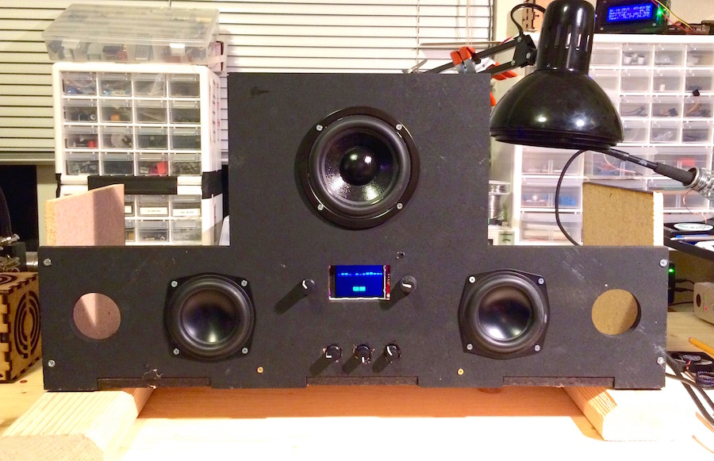

# kigaboom! 

Teensy + Audio Shield + TFT+ Infrared / Rotary Knobs = fully customizable audio digital signal processing station, with spectrum analyzer, peak meter, EQ and many more functions available via simple controls.

Design goal is to create a modular sofware that can power a Teensy + Audio Shield with the *SGTL5000* chipset, read input from line-in, possibly apply various filters/EQ/etc and send the output to Line-Out, all while showing spectrum analyzer using fourier transforms, peak metering, etc. 

The unit can be plugged into any custom stereo and sit between unit's line in and amplifier's audio input.

### Modularity 

It should be possible to disable various features of the compiled image by toggling flags in ```Hardware.h```. For example, to disable TFT display comment out line:

```c++

  // Feature flags.  Comment out to disable.
  // #define ENABLE_TFT
  // #define ENABLE_SPECTRUM
  #define ENABLE_PEAKS
  #define ENABLE_SHIFT_REGISTER
  #define ENABLE_ROTARY_ENC
```

Here is a quick pic of the prototype :)


